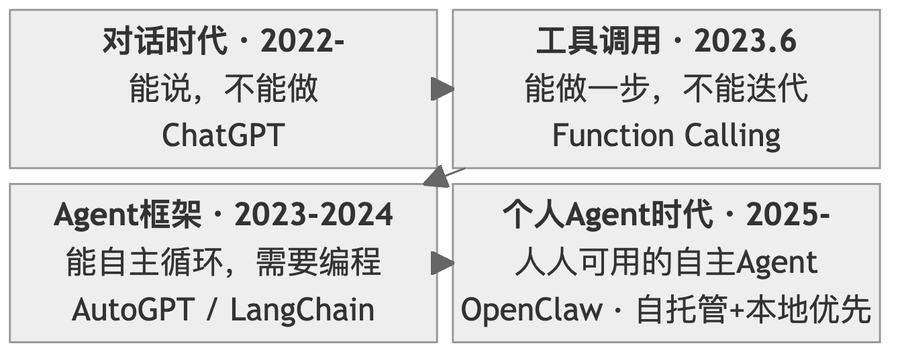
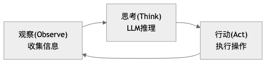
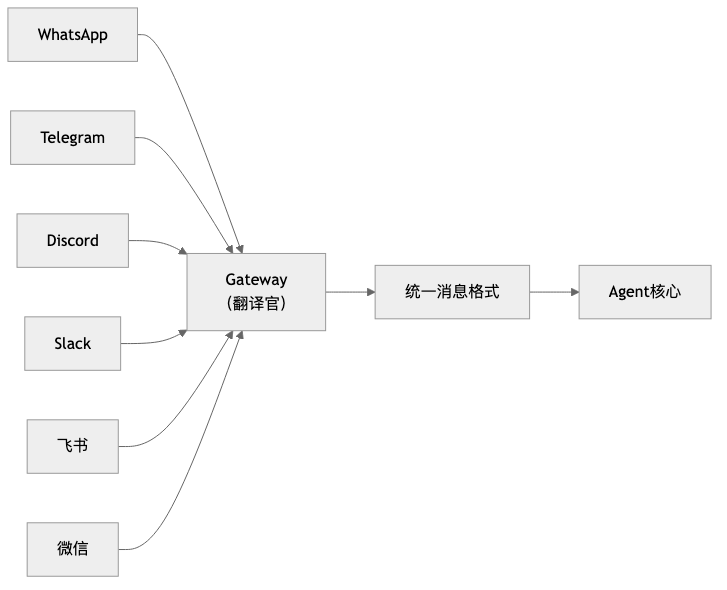

# Chapter 1: Architectural Design Philosophy — Why OpenClaw

> **Core Question**: How has AI Agent architecture evolved? What fundamental problems do OpenClaw's six architectural innovations solve? What does this system mean for us?

---

## Section 1: From Conversation to Execution — The Evolution of AI Agent Architecture

The core point of this section can be summed up in a single sentence: **OpenClaw did not appear out of thin air — it is the inevitable product of AI's journey from "knowing how to talk" to "knowing how to act."**

### 1.1 The Conversation Era: The "Read-Only" Dilemma of LLMs

In November 2022, the release of ChatGPT shook the world. People discovered that AI could write poetry, write code, translate languages, and answer almost any question.

But soon, the initial excitement gave way to a subtle disappointment:

    You: "Help me sort through the important emails in my inbox."

    ChatGPT: "Sure, here are the steps you can follow: 1. Open your email client 2. Create an 'Important' label 3. Filter by sender..."

It **knew how to do it**, but it **couldn't do it for you**.

This is the fundamental limitation of conversational AI — a learned "armchair philosopher." It had mastered the essence of human knowledge, yet had no hands to act with. Specifically, the limitations were: no agency, no state, no memory, no initiative.

These four "no's" formed the ceiling of the conversational era. AI was an encyclopedia, but not an assistant.

### 1.2 The Tool-Calling Era: Function Calling Breaks the Ice

In June 2023, OpenAI released the Function Calling feature — this was AI's first step from "being able to talk" to "being able to act."

**Core breakthrough**: LLMs could now output not only natural language, but also **structured function call requests**.

```
Traditional conversation mode:
  User: "What's the weather like in Beijing today?"
  AI: "You can check weather.com."  ← Can only tell you the method

Function Calling mode:
  User: "What's the weather like in Beijing today?"
  AI: { "function": "get_weather", "args": {"city": "Beijing"} }  ← Directly calls the API
  System: Executes function, returns result
  AI: "Beijing is sunny today, 23°C, northeast wind level 3."  ← Gives a real answer
```

For the first time, AI could "get its hands dirty." It was no longer just telling you how to do something — it was **doing it for you**.

But Function Calling had obvious limitations:

- **Single calls**: Only one function could be called at a time (though parallel calls were later supported, the fundamental nature didn't change)
- **No iteration**: Once called, it was done; if the result was wrong, human intervention was needed
- **Disconnected tools and reasoning**: The LLM first decided what to call, and could only see the result after calling — it couldn't think while observing
- **No persistence**: Each conversation was independent, with no long-term memory

To use an analogy: Function Calling was like giving a person **one hand** — it could pick things up now, but only once, then it had to wait for new instructions. This was far from what an "assistant" should look like.

### 1.3 The Agent Framework Era: Exploring Autonomous Loops

In October 2022, scholars from Princeton University and Google Research published the ReAct paper, proposing a key insight: **reasoning and action should be interleaved**.

```
Traditional approach: Plan all steps first → Execute step by step (one-shot, cannot adjust)

ReAct approach: Observe → Think → Act → Observe → Think → Act ... (iterative loop)
```

This meant AI was no longer "think first, then act," but rather — like a human — **thinking and acting simultaneously, adjusting based on feedback**.

This idea sparked an explosion of Agent frameworks: AutoGPT, LangChain, and CrewAI were released in rapid succession. These frameworks proved one thing: **AI Agents are feasible**. But they also revealed common limitations:

- **Developer-oriented**: Requires writing Python code to use
- **Requires programming**: Configuring an Agent requires understanding the APIs of frameworks like LangChain/LlamaIndex
- **No unified entry point**: Each framework has its own way of running, with no unified interaction interface
- **Cannot "work out of the box"**: Completely inaccessible to ordinary users

In other words, these frameworks answered the question of "can AI Agents do it," but didn't answer a more important question: **if AI Agents are so powerful, why can't ordinary people use them?**

### 1.4 The Personal Agent Era: From "Developer Tool" to "Accessible to Everyone"

The answer came from an unexpected place.

Austrian serial entrepreneur Peter Steinberger believed: **large companies had not built AI assistants that truly met individual needs**. So he decided to build one himself. That is how OpenClaw came to be — simple as that.

The fundamental difference between OpenClaw and all previous Agent frameworks is that it transformed a "high-and-mighty developer tool" into a "personal assistant accessible to everyone."

```
Barrier to using traditional Agent frameworks:

  Learn Python → Learn LangChain → Write code → Debug → Deploy → Use

Barrier to using OpenClaw:

  Install → Edit Markdown files → Send a message in WhatsApp
```

As of March 2026, OpenClaw has accumulated over 300,000 Stars, becoming **the fastest-growing open source project in GitHub history**.

From ChatGPT's "can talk but can't act," to Function Calling's "can act one step at a time," to Agent frameworks' "developers can use it," to OpenClaw's "everyone can use it" — AI has officially moved from the "conversation era" into the "execution era."



---

## Section 2: The Six Architectural Pillars — OpenClaw's Core Design Philosophy


Some have compared OpenClaw to a "digital life form" — and this is not an exaggeration. An Agent capable of autonomous action truly needs a complete functional system, just like a living organism:

- **ReAct Loop** — Engine (the core driving force that powers everything)
- **Prompt System** — Soul (the persistent identity that defines "who I am")
- **Tool System** — Hands and Feet (the ability to interact with the external world)
- **Message Loop** — Heartbeat (the life rhythm that keeps things running continuously)
- **Unified Gateway** — Senses (the information entry point that perceives multiple channels)
- **Security Sandbox** — Immune System (the protective mechanism that defends against risks)

Next, we will examine the design philosophy of each pillar one by one. For each "pillar," we will only discuss two questions: **What are the limitations of the old architecture? What are OpenClaw's advantages?**

### 2.1 Pillar One: The ReAct Loop — From "One Question, One Answer" to "Continuous Iteration"

**Limitations of the old architecture**

Traditional conversation is **linear**: you ask a question, AI answers, done. Traditional automation is **pre-programmed**: you write a script, it executes step by step, and crashes when something unexpected happens.

Neither can handle **real-world uncertainty** — you can't plan all the steps in advance, because the result of each step might change the direction of the next.

**OpenClaw's advantages**

OpenClaw's core engine is a perpetual **Observe-Think-Act** loop:



This loop has three key characteristics:

1. **Errors are not endpoints, but new observations**. A command failed to execute? The Agent doesn't crash — it treats the error as new information, rethinks, and adjusts its strategy.
2. **Model-agnostic**. Whether the underlying model is Claude, GPT, or a local model, they all run the same loop engine.
3. **Constrained freedom**. The framework is fixed (Observe → Think → Act), but the specific action in each round is flexible.

This is not a simple "ask more, answer more" — it is a **genuine iterative process** in which the Agent, like a human, explores complex tasks step by step and progressively converges on the goal.

→ See [Chapter 2: The ReAct Loop](../chapter2/index.md) for details

### 2.2 Pillar Two: The Prompt System — From "Temporary Instructions" to "Persistent Personality"

**Limitations of the old architecture**

Traditional prompts are **temporary** — they vanish when the conversation ends. The AI style you carefully tuned will revert to factory settings the next time you open a new conversation. You have to "re-educate" the AI every time; the AI has no **continuous identity**.

**OpenClaw's advantages**

OpenClaw uses **eight Markdown files** to define the Agent's complete personality:

| File | One-line description |
|------|---------------------|
| SOUL.md | Defines "who I am" — personality, values, behavioral principles |
| USER.md | Defines "who you are" — user profile, preferences |
| AGENTS.md | Defines "how I work" — decision rules, workflows |
| TOOLS.md | Defines "what resources I have" — environment configuration |
| IDENTITY.md | Name, avatar, and other basic identity information |
| MEMORY.md | Long-term memory — facts, experiences |
| HEARTBEAT.md | Scheduled task checklist |
| BOOTSTRAP.md | Initialization guide for the first run |

These files are automatically injected into the system prompt with each conversation, so the Agent **always knows who it is, who it is talking to, and how it should behave**.

Even more important is the **hot update** mechanism: you modify any `.md` file, and the moment you save it, the Agent's behavior changes. No restart required, no redeployment needed. This makes debugging and optimizing an Agent as simple as editing a document.

From "prompt engineering" to "prompt **system** engineering" — no longer writing a single perfect prompt, but designing a **continuously evolving prompt system**.

→ See [Chapter 3: The Prompt System](../chapter3/index.md) for details

### 2.3 Pillar Three: The Tool System — From "Unlimited Tools" to "Minimal Complete Set"

**Limitations of the old architecture**

How many tools should you give an Agent? This is a classic dilemma:

- **Too many tools** → The LLM struggles to choose; faced with dozens of tools, it doesn't know which to use
- **Too few tools** → Limited capability; can't even complete basic file operations
- **Too specialized tools** → New tools must be developed for each task, losing generality

**OpenClaw's advantages**

OpenClaw inherits the Unix philosophy — "do one thing, do it well" — and distills four **foundational tools**:

```
read  → Read (acquire information)
write → Create (generate new content)
edit  → Modify (precisely change existing content)
exec  → Execute (run Shell commands, interact with the external world)
```

Why are four enough? Because an Agent that can **read files, write files, edit files, and run commands**, by combining these four primitives, can accomplish almost **any local computing task**. Just as Unix's `cat`, `grep`, `sed`, and `awk` can be combined to produce endless functionality.

On top of the four foundational tools, OpenClaw implements modular capability extension through the **Skills** mechanism. Skills are essentially also Markdown files — describing professional knowledge and workflows in a particular domain — loaded by the Agent on demand, without overflowing the context window.

→ See [Chapter 4: The Tool System](../chapter4/index.md) for details

### 2.4 Pillar Four: The Message Loop and Event-Driven Architecture — From "Passive Response" to "Active Heartbeat"

**Limitations of the old architecture**

Traditional software is **request-response based**: you send a request, it returns a response. If you don't ask, it doesn't speak. Handling concurrent messages is also prone to confusion — if two users send messages at the same time, how do you ensure they don't get mixed up?

**OpenClaw's advantages**

OpenClaw's messaging system has three core designs:

**Lane model**. Each session is an independent "lane" — messages from the same user are processed in order (preventing "create file" and "read file" from being out of sequence), while messages from different users are processed in parallel (your 5-minute task won't block my quick query).

**Heartbeat mechanism**. The Agent has its own "biological clock." You write a checklist in `HEARTBEAT.md`, and the system periodically wakes the Agent to execute it. If there's nothing to pay attention to, the Agent silently returns `HEARTBEAT_OK` without disturbing you. If there is an important finding — for example, if you've asked it to monitor your Stripe revenue dashboard — it will proactively send you a message.

**Layered fault tolerance**. Three layers of fallback: task-level (tool call fails → retry or switch approach) → session-level (task fails → isolate impact, keep session active) → service-level (underlying service crashes → switch to backup provider or graceful degradation).

The Agent is not just "you ask, it answers" — it has its own rhythm and can **work proactively** like a real assistant.

→ See [Chapter 5: The Message Loop](../chapter5/index.md) for details

### 2.5 Pillar Five: The Unified Gateway — From "Platform Lock-In" to "One Entry Point, Countless Channels"

**Limitations of the old architecture**

Every time you connect a new messaging platform, you have to rewrite connection logic, message parsing, and authentication. N platforms means N times the development and maintenance cost. Moreover, identities across platforms are fragmented — the conversation you have with the Agent in Telegram is not visible in Discord.

**OpenClaw's advantages**

OpenClaw's Gateway acts like a translator:



The core design is the **adapter pattern**: each platform implements a `ChannelPlugin` interface, responsible for "translating" platform-specific message formats into a unified format. Want to connect a new platform? Just implement one interface — not a single line of Agent core code needs to change.

Even more elegant is **graceful degradation**. The Agent's responses are typically in Markdown format. Does Discord support rich text cards? The translator converts Markdown into beautiful embedded messages. Does Feishu support interactive buttons? The translator renders "Confirm/Cancel" buttons. Plain text platform? Falls back to clean text. **Unified without being monotonous, diverse without being chaotic**.

Cross-platform identity recognition is implemented through `identityLinks` configuration — you are the same person on Telegram, Discord, and Slack, and the Agent remembers your preferences across all channels.

→ See [Chapter 6: The Unified Gateway](../chapter6/index.md) for details

### 2.6 Pillar Six: The Security Sandbox — From "Full Permissiveness" to "Defense in Depth"

**Limitations of the old architecture**

The more capable the Agent, the greater the potential for damage. An Agent that can execute Shell commands could theoretically `rm -rf /` and delete your entire system. Completely prohibiting execution? Then the Agent loses its reason for existing.

**OpenClaw's advantages**

OpenClaw's security philosophy is: **not to restrict capability, but to add safety guardrails to capability**.

Three layers of defense in depth:

| Layer | What it defends against | Mechanism |
|-------|------------------------|-----------|
| Filesystem sandbox | Prevents unauthorized access | Agent can only operate within the designated working directory |
| Command execution sandbox | Prevents dangerous commands | Security mode (deny/allowlist/full) + Ask mode (confirmation mechanism) |
| Network access sandbox | Prevents malicious outbound connections | Allowlisted domain control |

Taking the `exec` tool as an example, it has a three-layer security model:

1. **Security mode** determines basic permissions — deny (block all), allowlist (whitelist), full (allow all)
2. **Ask mode** determines when human confirmation is required — off (never), on-miss (when not on the allowlist), always (ask every time)
3. **Safe command list (safeBins)** provides a convenient channel for read-only tools — safe commands like `jq`, `head`, `tail` can be executed directly

This design lets you **progressively build trust**: start with read-only mode, gradually open up execution permissions, and ultimately let the Agent operate autonomously with confidence under the protection of safety guardrails.

→ See [Chapter 7: The Security Sandbox](../chapter7/index.md) for details

### 2.7 How the Six Pillars Work Together: The Complete Journey of a Message

The six pillars are not six independent modules — they are **an organically interconnected system**. Understanding how they work together is the key to truly understanding what OpenClaw is.

We use the complete journey of a message to illustrate:

```
You send a message in WhatsApp: "Find all the console.log statements in the project"
```

OpenClaw's entire execution chain is as follows:

```
User message
  → Unified Gateway (sense, translate format)
  → Message Loop (dispatch, prevent concurrent confusion)
  → Prompt System (assemble context, inject soul)
  → ReAct Loop (observe → think → act, iterating repeatedly)
  → Security Sandbox (the security gate that every tool call must pass through)
  → Tool System (actually getting hands dirty and executing)
  → Result returns to ReAct Loop, until the task is complete
  → Unified Gateway (output, translate format)
→ User receives reply
```

Clearly, none of the six pillars can be missing — but in fact, none of these things appeared for the first time in OpenClaw. That is to say, OpenClaw did not invent anything new; it simply combined these six pillars in a very clever way, and together they constitute this complete, fully functional system.

---

## Section 3: Transformation and Adaptation — What This System Means

The emergence of OpenClaw is undoubtedly revolutionary. While it is still rapidly iterating, the conceptual framework it has proposed has been widely accepted. The core question of this section is: **What has OpenClaw changed? How do we adapt to this change?**

### 3.1 What OpenClaw Has Changed

#### OpenClaw has transformed Agents from tools exclusively for professional developers into assistants accessible to everyone.

This kind of threshold-crossing has happened before in history. Printing technology existed before Gutenberg, but movable type printing transformed books from the exclusive possession of scribes into something everyone could own — only then did the dissemination of knowledge truly change. The personal computer appeared in the 1970s, but it was Apple and IBM that brought it into ordinary homes, and only then did computing power truly change ordinary people's lives.

Every time a foundational capability has become cheap throughout history, it has reshuffled who gets to participate in complex affairs — the printing press changed knowledge production, the internet changed information dissemination. Cheap and universally accessible cognitive capability will likewise change **"who is qualified to do complex things."** This is not just an efficiency improvement; it is a change in the landscape of participants.

#### This brings about a shift in the bottleneck.

Anthropic's analysis of millions of real AI conversations shows that the more common form of current AI use is **augmenting human work**, rather than fully automating entire workflows. This illustrates one thing precisely: the most real near-term change is not "humans exit the process," but rather **humans moving from the execution position to the positions of defining, supervising, and accepting**. As a result, the bottleneck begins to shift:

- What was scarce before was "knowing how to do it"
- What is more scarce now is "knowing what to do and how to evaluate whether the result is correct"

This is also why, when Microsoft discusses the next-generation organizational model, it emphasizes "human supervisors + Agent teams," and McKinsey discusses "agentic organizations" rather than "more AI tools."
The truly hard part is no longer getting AI connected, but **rewriting processes, boundaries, and responsibilities around AI**.

Looking at this from a broader scale, it means two things:

1. **The barrier to participating in complex tasks is lowering**
   Things that originally required scripting ability, system knowledge, and tool proficiency can increasingly be triggered through "defining a task + providing context."

2. **Human value is moving up, not disappearing**
   When execution becomes cheap, judgment becomes expensive. Whoever can define goals, identify exceptions, and control risks stands at a position of higher leverage.

So what OpenClaw has changed is not "AI has become smarter," but rather: **complex tasks are beginning to enter ordinary people's workflows in a more accessible, more automated way.**

### 3.2 How to Adapt to the Changes Brought by OpenClaw

If section 3.1 clarified what OpenClaw has changed, then section 3.2 answers a more practical question: **Since execution is becoming cheaper and judgment is becoming scarcer, what exactly should we change about how we work?**

When many people first hear "you need to adapt to AI Agents," their first instinct is to learn prompt techniques, learn workflows, and learn various new buzzwords. But if you connect the earlier content of this chapter, you'll find that what really needs to be adapted is not that fancy at all.

**The core change that OpenClaw brings is just one thing: it means AI is no longer just chatting with you, but starting to act on your behalf.**
Once AI changes from "responder" to "executor," human roles change along with it. Before, the focus was on doing things ourselves; now what matters more is three things: communicate the task clearly, write your experience into rules, and keep the critical judgments in your own hands.

Put more plainly, working with OpenClaw is increasingly like bringing on a very capable new colleague. It's fast and sharp, but you can't just throw it a "use your judgment" and expect the result to perfectly match what you had in mind. Genuinely effective adaptation usually happens across the following three shifts.

#### First: shift from "raising requirements" to "assigning tasks"

When using software before, you just clicked buttons; then with chat models, you said one thing and it replied; but OpenClaw is different — it will keep doing things.
So the question is no longer "did I say something," but "did I communicate the task clearly."

For example, saying "help me organize the project documentation" — even a human colleague would ask follow-up questions, and of course an Agent will interpret it according to its own understanding. A better request usually includes at least four things:

- What result do you actually want
- What can it touch this time
- What counts as an acceptable result
- At what point should it stop and wait for your confirmation

You'll find that this is actually not some deep prompt engineering technique — it's the most ordinary common sense of collaboration.
OpenClaw just amplifies it. Because when execution speed gets faster, the cost of vagueness gets amplified along with it.

So the first step to adapting to OpenClaw is not learning to sound more like AI jargon, but learning to turn a vague thought into an executable task.

#### Second: shift from "keeping watch yourself" to "writing your experience in"

Many people, when first working with an Agent, feel a kind of fatigue: why do I have to explain things all over again every time?

"Don't just write conclusions in this report — also write the reasoning."
"Run tests before changing code."
"Don't touch live configuration settings first — come ask me first."

If these things only ever live in your head, then your relationship with the Agent will forever be stuck at "correcting on the go." That can work, but it's hard to sustain and hard to scale.

What's truly worth paying attention to in OpenClaw is that it gives you a set of places to deposit your experience: `AGENTS.md` can document processes, `MEMORY.md` can record preferences, `TOOLS.md` can supplement environment information, `SKILL.md` can encapsulate stable approaches for a particular category of work.

This step matters, because it determines whether you're "repeatedly retraining an assistant" or "slowly building a reusable system."

Ultimately, adapting to OpenClaw is not just about learning to use a tool — it's about learning to externalize your own work experience.
Whoever externalizes their experience into rules earlier will more easily turn the Agent from a one-off helper into long-term productivity.

#### Third: shift from "doing it yourself" to "overseeing the critical points"

Section 3.1 made it very clear: as execution becomes increasingly cheap, what truly becomes expensive is judgment.
In everyday work, this is actually quite simple: not every step is worth doing yourself, but some steps must be defined by you.

The three moments that should usually remain in human hands are:

- At the beginning, when deciding goals and boundaries
- In the middle, when encountering disagreements and exceptions
- At the end, when judging whether a result counts as complete

The searching, sorting, summarizing, drafting, converting, and iterative revising in between — these are exactly the parts that OpenClaw is best suited to take over.

But there is a very practical prerequisite here: **don't release all permissions from the start.**
A more reliable approach is usually to first let it read, look things up, and list plans; then let it revise drafts and produce candidate options; and only later consider letting it perform actions that have real side effects.

This is also why the security sandbox will be specifically covered later on. Not because OpenClaw is too dangerous, but because truly mature collaboration has never been "absolute trust" — it's always been "clear boundaries, and if something goes wrong, it can be contained."

#### In the end, what you're adapting to is a new work habit

Putting these three shifts together, the changes that OpenClaw brings are actually not that mysterious.

It's not suddenly requiring everyone to become an AI expert — it's reminding us:
What will be more valuable going forward may not be "how fast I can do things myself," but more likely:

- Can I communicate a task clearly
- Can I deposit my experience
- Can I make reliable judgments at critical points

This is also why the architectural designs discussed earlier in this chapter are not just technical details.
The ReAct loop determines that it is not a one-shot response, but something that will continuously push forward;
the prompt system determines that your experience can become the default rules;
the tool system and security sandbox determine that it can both do things and must be kept in check.

So adapting to OpenClaw, at its core, is not "learning how to use a more powerful AI" — it is **learning how to collaborate long-term with a system that can actually do things.**

Whoever completes this transition first will find it easier to truly benefit in the Agent era.

---

## Chapter Summary

**Core Insights**:

1. **Historical inevitability**. From conversational models to personal autonomous Agents, each step in the evolution has solved the core limitations of the previous generation. OpenClaw did not appear out of thin air — it is a natural extension along the evolutionary chain from AI that "can talk" to AI that "can act."

2. **The synergy of the six pillars**. The ReAct loop is the engine, the prompt system is the soul, the tool system is the hands and feet, the message loop is the heartbeat, the unified gateway is the senses, and the security sandbox is the immune system — all six are indispensable, together constituting a complete "digital life form."

3. **Direction set, details unsettled**. The broad direction of personal autonomous Agents is now clear, with major companies following suit, but specific implementations are still rapidly iterating. Understanding the underlying design philosophy matters more than chasing specific tools.

**Reading Guide**:

- If you want to **deeply understand** the technical details of each pillar → read chapters 2–7 in order
- If you want to **get started quickly** → jump to the practice section
- If you want to **grasp the big picture** → this chapter has already provided a complete cognitive map

**Next**: [Chapter 2: The ReAct Loop](../chapter2/index.md) — a deep dive into the Agent's core engine, understanding the perpetual "Observe-Think-Act" mechanism.
